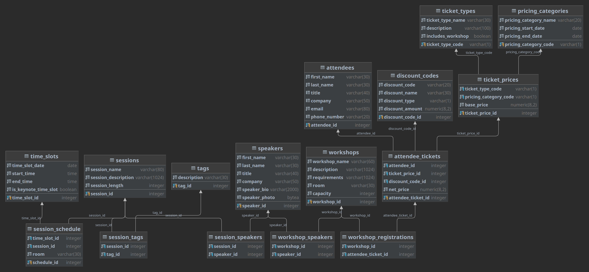

# Everance-End-Points
*************************************************
## => Everance-End-Points is a RESTful API for Everance.<==
*************************************************
Check out the [API Documentation]("")
*************************************************
# DB Schema: 
### Contain all kind of relations between tables.
#### Relations:
        ManyTOMany
        OneToMany
        OneToOne

*************************************************

*************************************************

# Contains the following endpoints:

# Session:
    POST:
        Creates a new session.
    DELETE:
        Deletes a session.
    GET:
        Gets a session.
    PUT:
        Updates a session.
    PATH:
        Update a session.

# Speaker:
    POST:
        Creates a new speaker.
    DELETE:
        Deletes a speaker.
    GET:
        Gets a speaker.
    PUT:
        Updates a speaker.
    PATH:
        Upadte a speaker.

# SessionSchedule:
    POST:
        Creates a new session schedule.
    DELETE:
        Deletes a session schedule.
    GET:
        Gets a session schedule.
    PUT:
        Updates a session schedule.
    PATH:
        Update a session schedule.

# Attendee:
    POST:
        Creates a new attendee.
    DELETE:
        Deletes a attendee.
    GET:
        Gets a attendee.
    PUT:
        Updates a attendee.
    PATH:
        Update a attendee.

# AttendeeTicket:
    POST:
        Creates a new attendee ticket.
    DELETE:
        Deletes a attendee ticket.
    GET:
        Gets a attendee ticket.
    PUT:
        Updates a attendee ticket.
    PATH:
        Update a attendee ticket.

# DiscountCode:
    POST:
        Creates a new discount code.
    DELETE:
        Deletes a discount code.
    GET:
        Gets a discount code.
    PUT:
        Updates a discount code.
    PATH:
        Update a discount code.

# PricingCategory:
    POST:
        Creates a new pricing category.
    DELETE:
        Deletes a pricing category.
    GET:
        Gets a pricing category.
    PUT:
        Updates a pricing category.
    PATH:
        Update a pricing category.

# Tag:
    POST:
        Creates a new tag.
    DELETE:
        Deletes a tag.
    GET:
        Gets a tag.
    PUT:
        Updates a tag.
    PATH:
        Update a tag.

# TicketPrice:
    POST:
        Creates a new ticket price.
    DELETE:
        Deletes a ticket price.
    GET:
        Gets a ticket price.
    PUT:
        Updates a ticket price.
    PATH:
        Update a ticket price.

# TicketType:
    POST:
        Creates a new ticket type.
    DELETE:
        Deletes a ticket type.
    GET:
        Gets a ticket type.
    PUT:
        Updates a ticket type.
    PATH:
        Update a ticket type.

# TimeSlot:
    POST:
        Creates a new time slot.
    DELETE:
        Deletes a time slot.
    GET:
        Gets a time slot.
    PUT:
        Updates a time slot.
    PATH:
        Update a time slot.

# Workshop:
    POST:
        Creates a new workshop.
    DELETE:
        Deletes a workshop.
    GET:
        Gets a workshop.
    PUT:
        Updates a workshop.
    PATH:
        Update a workshop.
